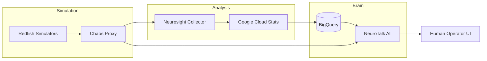

# 🧠 NeurOps Ecosystem
**AI-Powered Infrastructure Observability & Chaos Engineering**

[]()
[]()
[]()

NeurOps is a next-generation platform that closes the loop between raw hardware telemetry and intelligent operational response. By combining **Redfish hardware simulation**, **Chaos Engineering**, and **Agentic AI**, NeurOps provides a complete environment for developing and researching autonomous infrastructure.

---

## 🚀 Key Features

- **⚡ Agentic AI Assistant**: A specialized Google ADK Agent that understands infrastructure, analyzes BigQuery telemetry, and identifies root causes in natural language.
- **🌀 Chaos Management**: A dynamic proxy layer for real-time fault injection (thermal spikes, resource leaks, disk failures).
- **📡 Redfish Emulation**: Scalable simulation of data center hardware using standard RESTful APIs.
- **🚨 Intelligent Telemetry**: Built-in anomaly and trend detection that warns you of failures *before* they cross critical thresholds.
- **📊 Unified Dashboard**: A premium Streamlit UI providing a single pane of glass for telemetry and AI interaction.

---

## 🏗️ Architecture at a Glance



Want to understand the architecture deeply? ➡️ **[See doc/02-architecture-overview.md](docs/02-architecture-overview.md)**

---

## ⚡ Quick Start

### 1. Prerequisites
- Authenticate with Google: `gcloud auth application-default login`
- Set up a virtual environment: `python3 -m venv mylab && source mylab/bin/activate && pip install -r requirements.txt`

### 2. Launch the Ecosystem
NeurOps is fully orchestrated. Start everything with one command:
```bash
make startneurops
```
*This starts the simulators, proxy, intelligence collector, and chat UI.*

### 3. Talk to your Infra
Open `http://localhost:8501` to start chatting with **NeuroTalk**.

---

## 📚 Documentation Portal

| Section | Description |
| :--- | :--- |
| **[🚀 Introduction](docs/01-introduction.md)** | Mission, value, and high-level overview. |
| **[🏗️ Architecture](docs/02-architecture-overview.md)** | Technical design and tech stack details. |
| **[🌊 Project Flow](docs/03-project-flow.md)** | The journey of a metric (Step-by-step lifecycle). |
| **[🛠️ Setup Guide](docs/05-setup-guide.md)** | detailed onboarding and environmental cleanup. |
| **[📖 API Reference](docs/09-api-reference.md)** | Chaos Proxy and NeuroTalk API specs. |
| **[🔍 Troubleshooting](docs/10-debugging-troubleshooting.md)** | Common errors, logs, and diagnostic commands. |

### Module Deep Dives
- **[🕹️ Simulation Layer](docs/04-module-breakdown/simulation.md)**
- **[📡 Telemetry Layer](docs/04-module-breakdown/telemetry.md)**
- **[🧠 Interaction Layer](docs/04-module-breakdown/agents.md)**

---

## 🛠️ Tech Stack
- **Backend**: Python 3.12, FastAPI, Uvicorn.
- **AI/LLM**: Google Gemini 3 Flash, Google Agent Development Kit (ADK).
- **Data**: Google Cloud Pub/Sub, BigQuery.
- **Frontend**: Streamlit.
- **Infra**: Docker Compose, Redfish (Sushy).

---

## 🤝 Contributing
Ready to help? See our **[Contribution Guide](docs/11-contribution-guide.md)** for coding standards and development workflows.

---
**Last Updated:** April 2026 | **Environment:** `mylab`
