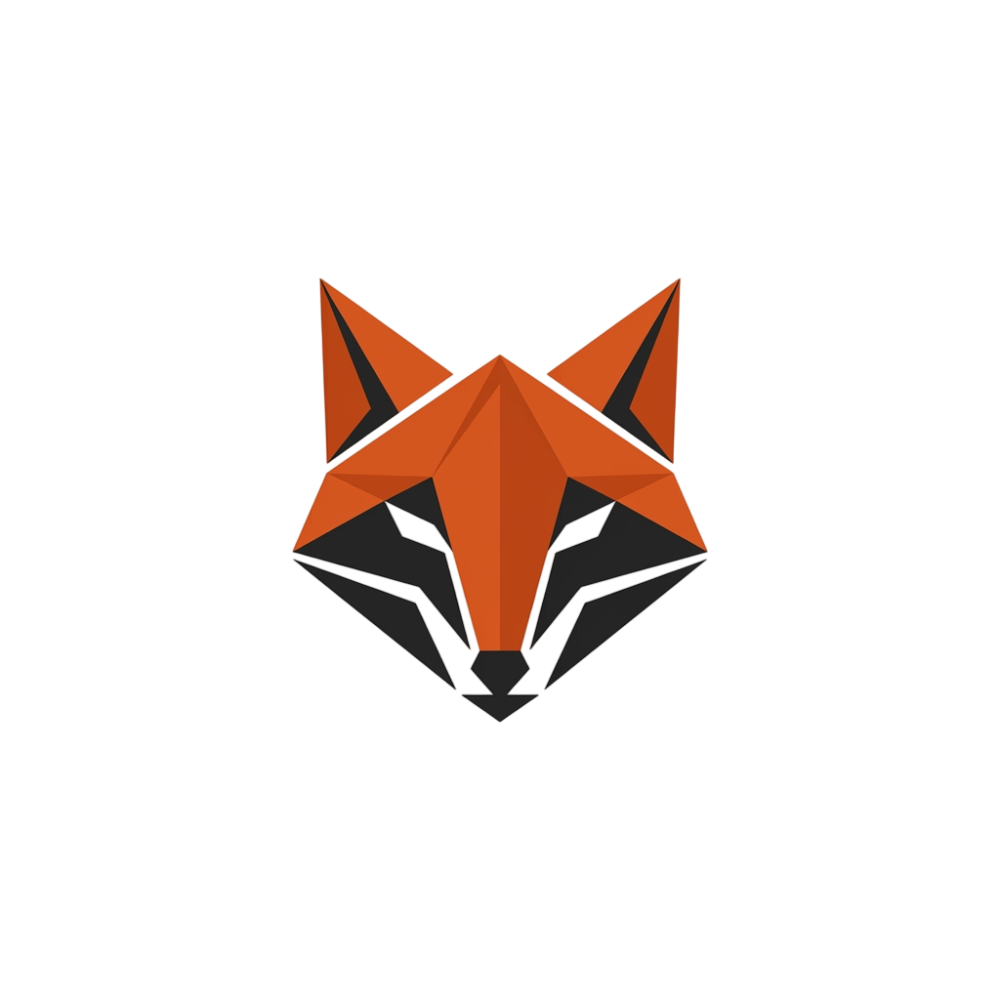
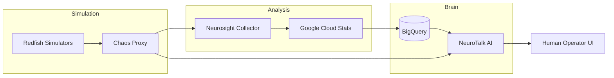

<p align="center">
  
</p>

# 🧠 NeurOps Ecosystem
**Enterprise-Grade AI Infrastructure Observability & Chaos Engineering**

[]()
[]()
[]()

NeurOps is a production-grade platform designed to bridge the gap between raw hardware telemetry and intelligent operational response. While this repository includes **Redfish Emulation** for rapid validation and chaos testing, the core architecture is engineered to scale across enterprise data centers, managing real-world hardware telemetry via standard Redfish APIs.

---

## 🎬 Guided Walkthroughs & Demos
New to NeurOps? Check out our video-guided steps to see the ecosystem in action! 🎥

- **[🚀 Full Workflow Demo](docs/13-manual-service-management.md#4-neurotalk-ui-streamlit)**: See how the AI interacts with real-time chaos events.
- **[🛠️ Manual Service Management](docs/13-manual-service-management.md)**: A step-by-step video guide on starting and stopping every service individually.
- **[🌀 Chaos Injection](docs/13-manual-service-management.md#3-chaos-management-routers)**: Watch how we inject hardware faults using the Chaos Proxy.

https://github.com/user-attachments/assets/6a603b2f-0a0e-4c74-ad5c-6f63d287dd30

---

## 🚀 Key Features

| Feature | Description |
| :--- | :--- |
| **⚡ Agentic AI Assistant** | A specialized Google ADK Agent that understands infrastructure and analyzes BigQuery telemetry in natural language. |
| **🌀 Chaos Management** | A dynamic proxy layer for real-time fault injection (thermal spikes, resource leaks, disk failures). |
| **📡 Redfish Emulation** | Scalable simulation of data center hardware using standard RESTful APIs. |
| **🚨 Intelligent Telemetry** | Built-in anomaly and trend detection that warns you of failures *before* they cross critical thresholds. |
| **📊 Unified Dashboard** | A premium Streamlit UI providing a single pane of glass for telemetry and AI interaction. |

---

## 🛡️ Production Readiness
NeurOps is built for more than just simulation. Every component is designed to consume real hardware data. To transition to production, simply swap the Redfish URLs in your `config.yaml` with your actual BMC (Baseboard Management Controller) endpoints.

#### 🩹 Autonomous Remediation Hooks
The **Auto-Healing** API endpoints provided in the Chaos Proxy are standardized hooks for production workloads. Engineers can tie their own automation logic (e.g., Ansible, Jenkins, or direct Redfish commands) to these endpoints.

---

## 🏗️ Architecture at a Glance



Want to understand the architecture deeply? ➡️ **[See doc/02-architecture-overview.md](docs/02-architecture-overview.md)**

---

## ⚡ Quick Start

### 1. Prerequisites
- Authenticate with Google: `gcloud auth application-default login`
- Set up a virtual environment: `python3 -m venv mylab && source mylab/bin/activate && pip install -r requirements.txt`

### 2. Launch the Ecosystem
NeurOps is fully orchestrated. Start everything with one command:
```bash
make startneurops
```
*This starts the simulators, proxy, intelligence collector, and chat UI.*

> [!TIP]
> Prefer a manual approach? We have a **[Video-Guided Manual Setup](docs/13-manual-service-management.md)** that walks you through every step! 📺

---

## 📚 Documentation Portal

| Section | Description |
| :--- | :--- |
| **[🚀 Introduction](docs/01-introduction.md)** | Mission, value, and high-level overview. |
| **[🏗️ Architecture](docs/02-architecture-overview.md)** | Technical design and tech stack details. |
| **[🌊 Project Flow](docs/03-project-flow.md)** | The journey of a metric (Step-by-step lifecycle). |
| **[🛠️ Setup Guide](docs/05-setup-guide.md)** | Detailed onboarding and environmental cleanup. |
| **[📖 API Reference](docs/09-api-reference.md)** | Chaos Proxy and NeuroTalk API specs. |
| **[🔍 Troubleshooting](docs/10-debugging-troubleshooting.md)** | Common errors, logs, and diagnostic commands. |
| **[⚙️ Manual Management](docs/13-manual-service-management.md)** | **Video-guided** commands to run services individually. |

---

## 🛠️ Tech Stack
- **Backend**: Python 3.12, FastAPI, Uvicorn
- **AI/LLM**: Google Gemini 3 Flash, Google Agent Development Kit (ADK)
- **Data**: Google Cloud Pub/Sub, BigQuery
- **Frontend**: Streamlit
- **Infra**: Docker Compose, Redfish (Sushy)

---

## 🤝 Contributing
Ready to help? See our **[Contribution Guide](docs/11-contribution-guide.md)** for coding standards and development workflows.

