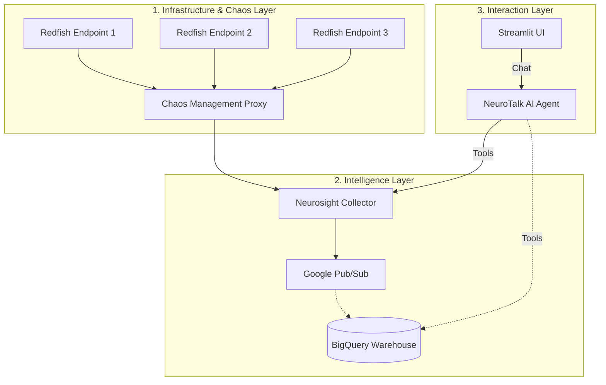

# 🏗️ Architecture Overview

NeurOps is built on a distributed, event-driven architecture that separates hardware connectivity, telemetry processing, and AI intelligence.

## 🗺️ System Map

## 층 Layers Breakdown

### 1. Infrastructure & Chaos Layer
- **Redfish Endpoints**: Standardized hardware interfaces speaking the DMTF Redfish protocol. NeurOps includes high-fidelity emulators for validation, but is designed to target real data center hardware directly.
- **Chaos Management Proxy**: A production-grade middleware that intercepts telemetry for advanced chaos engineering, fault injection, and traffic shaping.

### 2. Intelligence Layer
- **Neurosight Collector**: The heartbeat of the system. It scales horizontally to poll thousands of endpoints, apply statistical anomaly detection, and batch data for cloud ingestion.
- **Google Cloud Data Stack**: Uses **Pub/Sub** for real-time messaging and **BigQuery** for long-term telemetry storage and trend analysis.

### 3. Interaction Layer
- **NeuroTalk (AI Agent)**: Powered by Google ADK and Gemini. It is "tool-aware," meaning it knows how to query both live status and historical data to answer complex natural language questions.
- **Streamlit Dashboard**: A high-visibility interface for monitoring server health and chatting with the assistant.

---

## 🛠️ Tech Stack

- **Linguistics**: Python 3.12 (standardized on `mylab` venv).
- **Frontend**: Streamlit.
- **APIs**: FastAPI / Uvicorn.
- **AI**: Google ADK / Gemini 3 Flash.
- **Infra**: Docker Compose.
- **Cloud**: Google Cloud (Pub/Sub, BigQuery).

---

> [!IMPORTANT]
> To understand how data moves through these layers in real-time, see the [Project Flow Guide](03-project-flow.md).
