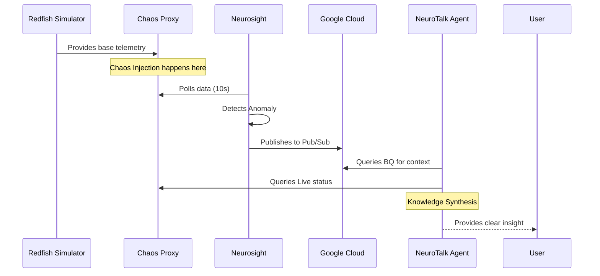

# 🌊 Project Flow: The Journey of a Metric

Ever wondered what happens from the moment a simulated server gets "too hot" to the moment the AI Assistant warns you about it? Here is the step-by-step lifecycle.

## 🧵 The End-to-End lifecycle

### 1. Generation 🐣
A **Redfish Simulator** (in `neurosim/`) generates a synthetic temperature reading.
- *Default*: 41°C.
- *Chaos*: If you trigger a "temperature high" chaos event, this number jumps to 95°C.

### 2. Interception 🛡️
The **Chaos Proxy** receives a request for system data.
- It fetches the "real" value from the simulator.
- If a "Chaos Injection" is active, it modifies the JSON payload on the fly (e.g., changing `TemperatureCelsius: 41` to `95`).

### 3. Collection & Detection 🔍
**Neurosight** (`neurosight/neurosight.py`) polls the proxy every 10 seconds.
- It extracts the temperature.
- It checks it against a **Trend Window** (last 5 samples).
- If the temperature has been strictly increasing or has crossed the threshold (e.g., >85°C), it tags the data with an `ALERT` flag (`TEMP_CRITICAL`).

### 4. Ingestion ☁️
**Neurosight** batches the metrics and publishes them to a **Google Cloud Pub/Sub** topic.
- From there, a Cloud Function (external to this repo) or a Dataflow job typically pipes the data into **BigQuery**.

### 5. Interaction 🧠
You open the **NeuroTalk UI** and ask: *"Is there anything wrong with server-1?"*
- The **NeuroTalk Agent** receives the question.
- The Agent decides which "Tool" to use:
    - **`get_live_status`**: Calls the Chaos Proxy directly for the *exact* current reading.
    - **`get_past_issues`**: Queries BigQuery for the last 10 records to see if this is a recurring problem.

### 6. Insight 🗣️
The Agent combines the live data ("It's 95°C right now!") with the historical context ("This has happened 3 times today!") and gives you a natural language answer: 
> "Yes, Server-1 is currently experiencing critical thermal issues (95°C), and looking at the history, this appears to be a trending failure."

---

## 🔁 Flow Diagram

---

> [!TIP]
> To dive deeper into how these modules are built, visit the [Module Breakdown](../docs/04-module-breakdown/simulation.md).
